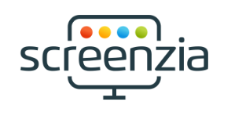

# Website Screenshot Generator - Screenzia



In this project, web application will allow its users to get an programmatically automated screenshot of any website in seconds.

---


## Table of contents
- [Website Screenshot Generator - Screenzia](#website-screenshot-generator---screenzia)
  - [Table of contents](#table-of-contents)
  - [Getting Started](#getting-started)
  - [Project Problem](#project-problem)
  - [Project Motivation](#project-motivation)
  - [Project Goals](#project-goals)
  - [Folder Structure](#folder-structure)
  - [Installation](#installation)
  - [Screenshots](#screenshots)
    - [Signup (localhost:3000/signup)](#signup-localhost3000signup)
    - [Signin (localhost:3000/signin)](#signin-localhost3000signin)
    - [Dashboard (localhost:3000/)](#dashboard-localhost3000)
  - [Tools/Technologies](#toolstechnologies)
  - [Contributors ✨](#contributors-)
  - [Deploy on Vercel](#deploy-on-vercel)


## Getting Started

First, run the development server:

```bash
npm run dev
# or
yarn dev
```

Open [http://localhost:3000](http://localhost:3000) with your browser to see the result.

## Project Problem

We need to get an automated screenshot of a website. Just paste the URL of the website in the input field and click the `Submit` button. The screenshot will be generated. The screenshot will be saved in the supabase storage. Each user folder will be named by the user's unique ID when they registered on the website. The screenshot will be saved in the user's Ids folder.

## Project Motivation

Learning latest technologies like Next.js, TypeScript, and React, TalwindCSS, RestAPIs is a great motivation for us to create this project. We want to make this project as easy as possible for users to use.

## Project Goals

* Create a web application that allows users to get an automated screenshot of a website in seconds.
* Try to follow best practices for web applications.
* Building custom users interfaces by using TalwindCSS Framework.
* Using TypeScript because its a superset of typed JavaScript that can be used to write clean, readable, and efficient code with additional features like strong static typing and compilation.

## Folder Structure

* /pages/api/ - API routes - This folder contains all code we need to access APIs for our application.
  * /api/screenshot.ts - take screenshot using playwright and chrome-aws-lambda packages and save it into the supabase storage
  * /api/all-screenshot.ts - get all screenshot taken by a user from supabase storage bucket.
* /pages/ - React pages - This folder contains all React components that will be used in our application. Next.js will treat every component in this folder as a page.
  * /pages/ - this route uses default index.tsx file which is a dashboard file.
  * /pages/signin - signin page
  * /pages/signout - signout page
  * /pages/signup - signup page
* /public/ - Static assets - This folder contains all static assets that will be used in our application.
* /src/utils/ - Utility functions - This folder contains all utility functions that will be used in our application.
* /styles - Styles - This folder contains global styles that will be used in our application.
* For CSS we are using TalwindCSS which is a utility-first CSS framework. TailwindCSS is very popular and has a lot of advantages for experienced developers who just need utility classes to quickly build beautiful custom designs.

## Installation
To get this project up and running locally on your computer:

1. Clone the repo by SSH  [SSH Repo](git@github.com:abdsamadf/Website-Screenshot-Generator.git)
 Or by [HTTPS Repo](https://github.com/abdsamadf/Website-Screenshot-Generator.git)
2. Run `npm install` to install all packages.
3. Create a supabase account for using DB and Storage for our application
4. Create `.env.local` to find and add this two variable.
```bash
NEXT_PUBLIC_SUPABASE_URL
NEXT_PUBLIC_SUPABASE_ANON_KEY
```
5. Run the development server
```bash
npm run dev
# or
yarn dev
```

## Screenshots


### Signup (localhost:3000/signup)


### Signin (localhost:3000/signin)

### Dashboard (localhost:3000/)


## Tools/Technologies
1. **Next.js** - [https://nextjs.org/](https://nextjs.org/) - The React Framework for Production. Next.js gives you the best developer experience with all the features you need for production: hybrid static & server rendering, TypeScript support, smart bundling, route pre-fetching, and more. No config needed.
2. **React** - A JavaScript library for building user interfaces
3. **TalwindCSS** - A utility-first CSS framework for rapidly building custom user interfaces. [https://tailwindcss.com/](https://tailwindcss.com/)
4. **TypeScript** - TypeScript is a strongly typed programming language that builds on JavaScript, giving you better tooling at any scale. [https://www.typescriptlang.org/](https://www.typescriptlang.org/)
5. **Supabase DB and Storage** - Supabase is an open source Start your project with a Postgres Database, Authentication, instant APIs, Realtime subscriptions and Storage. [https://supabase.io/](https://supabase.io/)
6. **Playwright and chrome-aws-lambda packages** - Playwright is a framework for Web Testing and Automation. It allows testing Chromium, Firefox and WebKit with a single API. Playwright is built to enable cross-browser web automation that is ever-green, capable, reliable and fast.

## Contributors ✨

Thanks goes to these wonderful people ([emoji key](https://allcontributors.org/docs/en/emoji-key)):
<!-- ALL-CONTRIBUTORS-LIST:START - Do not remove or modify this section -->
<!-- prettier-ignore-start -->
<!-- markdownlint-disable -->
<table>
  <tr>
    <td align="center"><a href="https://abdulmoiz.me"><br /><sub><b>Abdul Moiz</b></sub></a><br /><a href="#" title="Code">💻</a> <a href="#ideas-progrmoiz" title="Ideas, Planning, & Feedback">🤔</a></td>
    <td align="center"><a href="https://github.com/abdsamadf"><br /><sub><b>Abdul Samad</b></sub></a><br /><a href="#" title="Code">💻</a> <a href="#" title="Documentation">📖</a></td>
    </tr>
</table>

<!-- markdownlint-restore -->
<!-- prettier-ignore-end -->

<!-- ALL-CONTRIBUTORS-LIST:END -->

<!-- ALL-CONTRIBUTORS-LIST:START - Do not remove or modify this section -->
<!-- prettier-ignore-start -->
<!-- markdownlint-disable -->

<!-- markdownlint-restore -->
<!-- prettier-ignore-end -->

<!-- ALL-CONTRIBUTORS-LIST:END -->

This project follows the [all-contributors](https://allcontributors.org) specification.
Contributions of any kind are welcome!


## Deploy on Vercel

The easiest way to deploy your Next.js app is to use the [Vercel Platform](https://vercel.com/new?utm_medium=default-template&filter=next.js&utm_source=create-next-app&utm_campaign=create-next-app-readme) from the creators of Next.js.

We successfully deployed our application on Vercel on [link](https://website-screenshot-generator.vercel.app) but the problem on the deployed version is that for playwright  need chrome browser for screenshot taken. But the browser size now a days is more than 100mbs and vercel limit the file to less than 50mb.
